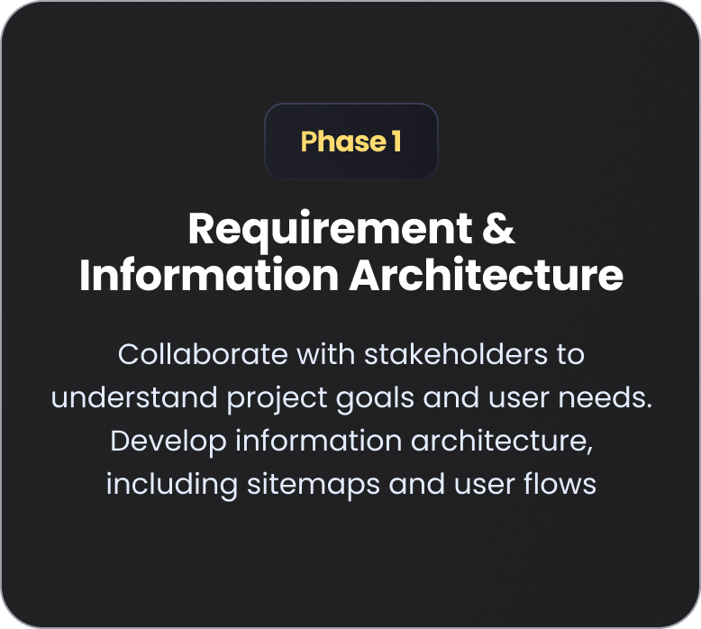
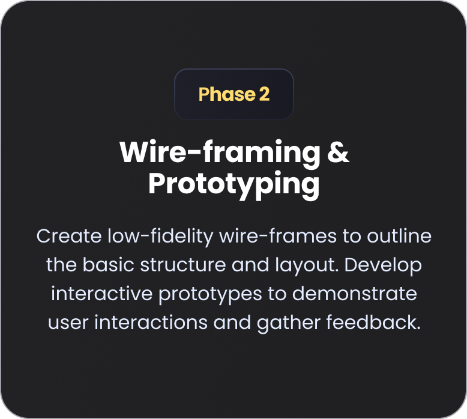
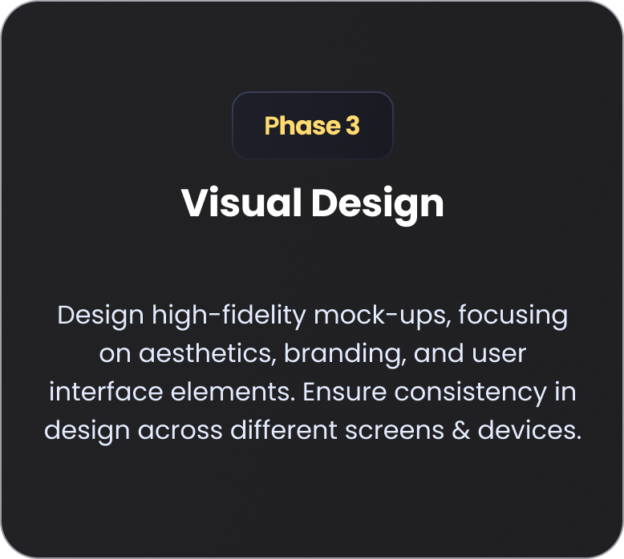
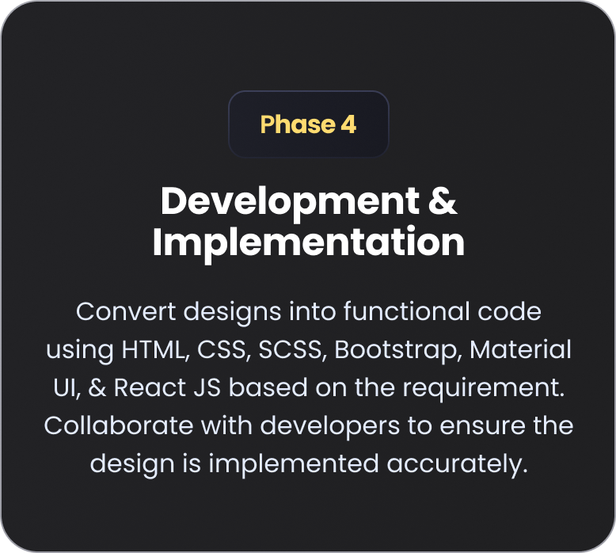
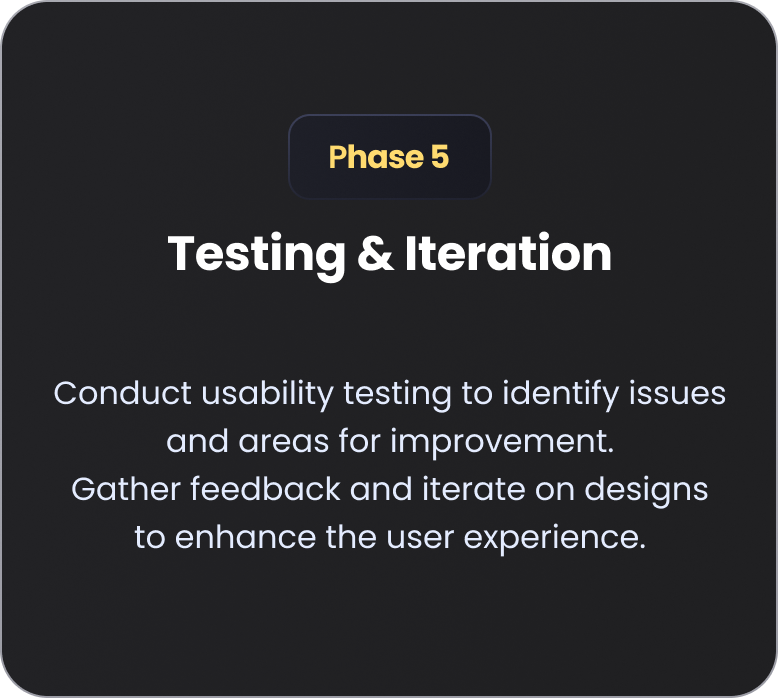

<!DOCTYPE html>
<html lang="en">

<head>
  <meta charset="UTF-8">
  <meta http-equiv="X-UA-Compatible" content="IE=edge">
  <meta name="viewport" content="width=device-width, initial-scale=1.0">
  <title>Oviya Portfolio</title>

  <!--
    - favicon
  -->
  <link rel="shortcut icon" href="./images/logo.ico" type="image/x-icon">

  <!--
    - custom css link
  -->
  <link rel="stylesheet" href="./css/style.css">
  <!--
    - google font link
  -->
  <link rel="preconnect" href="https://fonts.googleapis.com">
  <link rel="preconnect" href="https://fonts.gstatic.com" crossorigin>
  <link href="https://fonts.googleapis.com/css2?family=Poppins:wght@300;400;500;600&display=swap" rel="stylesheet">
</head>

<body>

  <!--
    - #MAIN
  -->

  <main>

    <!--
      - #SIDEBAR
    -->

    <aside class="sidebar" data-sidebar="">

      

        <figure class="avatar-box">
          
          
        </figure>

        

          <h1 class="name" title="Om Kharche">Kasetty Nanda Kumar</h1>

          
UI/UX Developer

        

        <button class="info_more-btn" data-sidebar-btn="">
          Show Contacts

          <ion-icon name="chevron-down" role="img" class="md hydrated" aria-label="chevron down"></ion-icon>
        </button>

      

      

        

        <ul class="contacts-list">

          <li class="contact-item">

            

              
            

            

              
Email

              <a href="mailto:omtestmail@gmail.com" class="contact-link">royalnandakumar@gmail.com</a>
            

          </li>

          <li class="contact-item">

            

              
            

            

              
Phone

              <a href="tel:+918919133190" class="contact-link">+91 8919133190</a>
            

          </li>

          <!-- <li class="contact-item">

            

              <ion-icon name="calendar-outline"></ion-icon>
            

            

              
Birthday

              <time datetime="1982-06-23">2 March, 2003</time>
            

          </li> -->

          <li class="contact-item">

            

              
            

            

              
Location

              <address>Chennai, India</address>
            

          </li>

        </ul>

        

        <ul class="social-list">

          <!-- <li class="social-item">
            <a href="#" class="social-link">
              <ion-icon name="logo-facebook"></ion-icon>
            </a>
          </li> -->

          <li class="social-item">
            <a href="https://www.linkedin.com/in/kasetty-nanda-kumar/" class="social-link">
              <ion-icon name="logo-linkedin" role="img" class="md hydrated" aria-label="logo linkedin"></ion-icon>
            </a>
          </li>

          <li class="social-item">
            <a href="https://www.instagram.com/nanda_kumar_kasetty/" class="social-link">
              <ion-icon name="logo-instagram" role="img" class="md hydrated" aria-label="logo instagram"></ion-icon>
            </a>
          </li>

        </ul>

      

    </aside>

    <!--
      - #main-content
    -->

    

      <!--
        - #NAVBAR
      -->

      <nav class="navbar">

        <ul class="navbar-list">

          <li class="navbar-item">
            <button class="navbar-link  active" data-nav-link="">About</button>
          </li>

          <li class="navbar-item">
            <button class="navbar-link" data-nav-link="">Background</button>
          </li>

          <li class="navbar-item">
            <button class="navbar-link" data-nav-link="">Projects</button>
          </li>

          <!-- <li class="navbar-item">
            <button class="navbar-link" data-nav-link>Blog</button>
          </li>

          <li class="navbar-item">
            <button class="navbar-link" data-nav-link>Contact</button>
          </li> -->

        </ul>

      </nav>

      <!--
        - #ABOUT
      -->

      <article class="about  active" data-page="about">

        <header>
          <h2 class="h2 article-title">About me</h2>
        </header>

        <section class="about-text">
          

            With over 2.5 years of comprehensive experience in UI/UX Development, I have played a dual role as both a UI
            and UX Developer, contributing to various web applications, websites, and portals. My focus has been on
            creating user-friendly, functional, and visually appealing interfaces that deliver optimal digital
            experiences. I am proficient in HTML, CSS, SCSS, Bootstrap, Material UI, JavaScript, and the React JS
            framework, ensuring the technical implementation aligns with the latest standards. Additionally, 

          
I have a strong background in the UX design process, including gathering and analyzing requirements,
            developing
            information architecture, crafting wireframes and prototypes, and executing visual design. My approach
            ensures that every product I work on is not only functional but also intuitive and aesthetically engaging.
          

        </section>

        <!--
          - service
        -->

        <section class="service">

          <h3 class="h3 service-title">What i'm doing</h3>

          <ul class="service-list">

            <li class="service-item">

              

                
              

              

                <h4 class="h4 service-item-title">User experience Design</h4>

                

                  Information architectures, Wireframes, Prototypes and Visual Designs
                

              

            </li>

            <li class="service-item">

              

                
              

              

                <h4 class="h4 service-item-title">Web development</h4>

                

                  High-quality development of web-sites and web-applications at the professional level.
                

              

            </li>

            <!-- <li class="service-item">

              

                
              

              

                <h4 class="h4 service-item-title">Mobile apps designs</h4>

                

                  Professional development of applications for iOS and Android.
                

              

            </li>

            <li class="service-item">

              

                
              

              

                <h4 class="h4 service-item-title">Photography</h4>

                

                  I make high-quality photos of any category at a professional level.
                

              

            </li> -->

          </ul>

        </section>

        <!--
          - testimonials
        -->

        <section class="testimonials">

          <h3 class="h3 testimonials-title">Testimonials</h3>

          <ul class="testimonials-list has-scrollbar">

            <li class="testimonials-item">
              

                <figure class="testimonials-avatar-box">
                  
                </figure>

                <h4 class="h4 testimonials-item-title" data-testimonials-title=""></h4>

                

                  

                    I prioritize client collaboration by fostering open and transparent communication throughout the
                    project. By actively engaging in discussions and gathering feedback, I ensure the final product
                    aligns perfectly with the client’s vision. This approach builds trust and delivers results that meet
                    and exceed expectations
                  

                

              

            </li>

            <li class="testimonials-item">
              

                <figure class="testimonials-avatar-box">
                  
                </figure>

                <h4 class="h4 testimonials-item-title" data-testimonials-title=""></h4>

                

                  

                    I’m very flexible with time zone communications, ensuring that I'm available to collaborate with
                    clients regardless of their location. This flexibility allows for seamless coordination and timely
                    responses, making the project process smooth and efficient.
                  

                

              

            </li>

            <li class="testimonials-item">
              

                <figure class="testimonials-avatar-box">
                  
                </figure>

                <h4 class="h4 testimonials-item-title" data-testimonials-title=""></h4>

                

                  

                    My tech stack includes HTML, CSS, SCSS, Bootstrap, Material UI, JavaScript, React JS, Figma, and Adobe XD.
                  

                

              

            </li>

          </ul>

        </section>

        <!--
          - testimonials modal
        -->

        

          

          <section class="testimonials-modal">

            <button class="modal-close-btn" data-modal-close-btn="">
              <ion-icon name="close-outline" role="img" class="md hydrated" aria-label="close outline"></ion-icon>
            </button>

            

              <figure class="modal-avatar-box">
                
              </figure>

              
            

            

              <h4 class="h3 modal-title" data-modal-title="">Daniel lewis</h4>

              

                

                  Richard was hired to create a corporate identity. We were very pleased with the work done. She has a
                  lot of experience
                  and is very concerned about the needs of client. Lorem ipsum dolor sit amet, ullamcous cididt
                  consectetur adipiscing
                  elit, seds do et eiusmod tempor incididunt ut laborels dolore magnarels alia.
                

              

            

          </section>

        

        <!--
          - My approach
        -->

        <section class="clients">

          <h3 class="h3 clients-title">My approach</h3>

          <ul class="clients-list has-scrollbar">

            <li class="clients-item">
              
            </li>

            <li class="clients-item">
              
            </li>

            <li class="clients-item">
              
            </li>

            <li class="clients-item">
              
            </li>

            <li class="clients-item">
              
            </li>

            

          </ul>

        </section>

      </article>

      <!--
        - #RESUME
      -->

      <article class="resume" data-page="background">

        <header>
          <h2 class="h2 article-title">Resume</h2>
        </header>

        <section class="timeline">

          

            

              <ion-icon name="book-outline" role="img" class="md hydrated" aria-label="book outline"></ion-icon>
            

            <h3 class="h3">Education</h3>
          

          <ol class="timeline-list">

            <li class="timeline-item">

              <h4 class="h4 timeline-item-title">Saveetha School of Engineering </h4>

              2017 — 2021

              

                Completed BE Mechanical Engineering in SSE Chennai
              

            </li>

            <li class="timeline-item">

              <h4 class="h4 timeline-item-title">Class 12th</h4>

              2015 — 2017

              

                Completed 12th from Narayana Jr. Collage - Board of Intermediate Education Andhra Pradesh, Kadapa 
              

            </li>

            <li class="timeline-item">

              <h4 class="h4 timeline-item-title">Class 10th</h4>

              2015

              

                Completed 12th from D.A.V High School - Board of Secondary Education Andhra Pradesh, Kadapa 
              

            </li>

          </ol>

        </section>

        <section class="timeline">

          

            

              <ion-icon name="book-outline" role="img" class="md hydrated" aria-label="book outline"></ion-icon>
            

            <h3 class="h3">Experience</h3>
          

          <ol class="timeline-list">

            <li class="timeline-item">

              <h4 class="h4 timeline-item-title">UI/UX Engineer</h4>

              2021 — 2024

              

                With over 2.5 years of comprehensive experience in UI/UX Development from Avasoft Chennai
              

            </li>

           

          </ol>

        </section>

        <!-- <section class="skill">

          <h3 class="h3 skills-title">My skills</h3>

          <ul class="skills-list content-card">

            <li class="skills-item">

              

                <h5 class="h5">Web design</h5>
                <data value="80">80%</data>
              

              

                

              

            </li>

            <li class="skills-item">

              

                <h5 class="h5">Graphic design</h5>
                <data value="70">70%</data>
              

              

                

              

            </li>

            <li class="skills-item">

              

                <h5 class="h5">Branding</h5>
                <data value="90">90%</data>
              

              

                

              

            </li>

            <li class="skills-item">

              

                <h5 class="h5">WordPress</h5>
                <data value="50">50%</data>
              

              

                

              

            </li>

          </ul>

        </section> -->

      </article>

      <!--
        - #PORTFOLIO
      -->

      <article class="portfolio" data-page="projects">

        <header>
          <h2 class="h2 article-title">Portfolio</h2>
        </header>

        <section class="projects">

          <ul class="filter-list">

            <li class="filter-item">
              <button class="active" data-filter-btn="">All</button>
            </li>

            <li class="filter-item">
              <button data-filter-btn="">Web design</button>
            </li>

            <li class="filter-item">
              <button data-filter-btn="">Applications</button>
            </li>

            <li class="filter-item">
              <button data-filter-btn="">Web development</button>
            </li>

          </ul>

          

            <button class="filter-select" data-select="">

              
Select category

              

                <ion-icon name="chevron-down" role="img" class="md hydrated" aria-label="chevron down"></ion-icon>
              

            </button>

            <ul class="select-list">

              <li class="select-item">
                <button data-select-item="">All</button>
              </li>

              <li class="select-item">
                <button data-select-item="">Web design</button>
              </li>

              <li class="select-item">
                <button data-select-item="">Applications</button>
              </li>

              <li class="select-item">
                <button data-select-item="">Web development</button>
              </li>

            </ul>

          

          <ul class="project-list">

            <li class="project-item  active" data-filter-item="" data-category="web design">
              <a href="https://www.figma.com/proto/EcuHy1Ah5RUJima5xOn8ef/Real-Estate-Website-UI-Template?node-id=203-8&amp;t=qFdzZv5yNb1yntps-1&amp;scaling=min-zoom&amp;content-scaling=fixed&amp;page-id=45%3A2&amp;starting-point-node-id=203%3A8">

                <figure class="project-img">
                  

                    <ion-icon name="eye-outline" role="img" class="md hydrated" aria-label="eye outline"></ion-icon>
                  

                  
                </figure>

                <h3 class="project-title">Real-Estate-Website-UI-Template</h3>

                
Web design

              </a>
            </li>

            <li class="project-item  active" data-filter-item="" data-category="web development">
              <a href="https://nandakumarroy.github.io/dash-board/">

                <figure class="project-img">
                  

                    <ion-icon name="eye-outline" role="img" class="md hydrated" aria-label="eye outline"></ion-icon>
                  

                  
                </figure>

                <h3 class="project-title">React dash-board</h3>

                
Web development

              </a>
            </li>

            <li class="project-item  active" data-filter-item="" data-category="applications">
              <a href="https://www.figma.com/proto/vHVD6rAKPEwTgL9WTbbV6t/E-com-Mobile-Application-Design?node-id=1-2069&amp;t=BIgTja64cHYnh6BA-1&amp;scaling=min-zoom&amp;content-scaling=fixed&amp;page-id=1%3A1364&amp;starting-point-node-id=1%3A2263&amp;show-proto-sidebar=1">

                <figure class="project-img">
                  

                    <ion-icon name="eye-outline" role="img" class="md hydrated" aria-label="eye outline"></ion-icon>
                  

                  
                </figure>

                <h3 class="project-title">E-Com Mobile App-UI-Template</h3>

                
Applications

              </a>
            </li>

           

          </ul>

        </section>

      </article>

      <!--
        - #BLOG
      -->

      <!-- <article class="blog" data-page="blog">

        <header>
          <h2 class="h2 article-title">Blog</h2>
        </header>

        <section class="blog-posts">

          <ul class="blog-posts-list">

            <li class="blog-post-item">
              <a href="#">

                <figure class="blog-banner-box">
                  
                </figure>

                

                  

                    
Design

                    

                    <time datetime="2022-02-23">Fab 23, 2022</time>
                  

                  <h3 class="h3 blog-item-title">Design conferences in 2022</h3>

                  

                    Veritatis et quasi architecto beatae vitae dicta sunt, explicabo.
                  

                

              </a>
            </li>

            <li class="blog-post-item">
              <a href="#">

                <figure class="blog-banner-box">
                  
                </figure>

                

                  

                    
Design

                    

                    <time datetime="2022-02-23">Fab 23, 2022</time>
                  

                  <h3 class="h3 blog-item-title">Best fonts every designer</h3>

                  

                    Sed ut perspiciatis, nam libero tempore, cum soluta nobis est eligendi.
                  

                

              </a>
            </li>

            <li class="blog-post-item">
              <a href="#">

                <figure class="blog-banner-box">
                  
                </figure>

                

                  

                    
Design

                    

                    <time datetime="2022-02-23">Fab 23, 2022</time>
                  

                  <h3 class="h3 blog-item-title">Design digest #80</h3>

                  

                    Excepteur sint occaecat cupidatat no proident, quis nostrum exercitationem ullam corporis suscipit.
                  

                

              </a>
            </li>

            <li class="blog-post-item">
              <a href="#">

                <figure class="blog-banner-box">
                  
                </figure>

                

                  

                    
Design

                    

                    <time datetime="2022-02-23">Fab 23, 2022</time>
                  

                  <h3 class="h3 blog-item-title">UI interactions of the week</h3>

                  

                    Enim ad minim veniam, consectetur adipiscing elit, quis nostrud exercitation ullamco laboris nisi.
                  

                

              </a>
            </li>

            <li class="blog-post-item">
              <a href="#">

                <figure class="blog-banner-box">
                  
                </figure>

                

                  

                    
Design

                    

                    <time datetime="2022-02-23">Fab 23, 2022</time>
                  

                  <h3 class="h3 blog-item-title">The forgotten art of spacing</h3>

                  

                    Maxime placeat, sed do eiusmod tempor incididunt ut labore et dolore magna aliqua.
                  

                

              </a>
            </li>

            <li class="blog-post-item">
              <a href="#">

                <figure class="blog-banner-box">
                  
                </figure>

                

                  

                    
Design

                    

                    <time datetime="2022-02-23">Fab 23, 2022</time>
                  

                  <h3 class="h3 blog-item-title">Design digest #79</h3>

                  

                    Optio cumque nihil impedit uo minus quod maxime placeat, velit esse cillum.
                  

                

              </a>
            </li>

          </ul>

        </section>

      </article> -->

      <!--
        - #CONTACT
      -->

      <!-- <article class="contact" data-page="contact">

        <header>
          <h2 class="h2 article-title">Contact</h2>
        </header>

        <section class="mapbox" data-mapbox>
          <figure>
            <iframe
              src="https://maps.google.com/maps?width=100%25&amp;height=600&amp;hl=en&amp;q=chennai+(My%20Business%20Name)&amp;t=&amp;z=14&amp;ie=UTF8&amp;iwloc=B&amp;output=embed"
              width="400" height="300" loading="lazy"></iframe>
          </figure>
        </section>

        <section class="contact-form">

          <h3 class="h3 form-title">Contact Form</h3>

          <form action="#" class="form" data-form>

            

              <input type="text" name="fullname" class="form-input" placeholder="Full name" required data-form-input>

              <input type="email" name="email" class="form-input" placeholder="Email address" required data-form-input>
            

            <textarea name="message" class="form-input" placeholder="Your Message" required data-form-input></textarea>

            <button class="form-btn" type="submit" disabled data-form-btn>
              <ion-icon name="paper-plane"></ion-icon>
              Send Message
            </button>

          </form>

        </section>

      </article> -->

    

  </main>

  <!--
    - custom js link
  -->
  

  <!--
    - ionicon link
  -->
  
  

</body>

</html>
