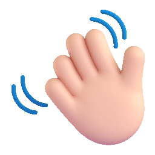
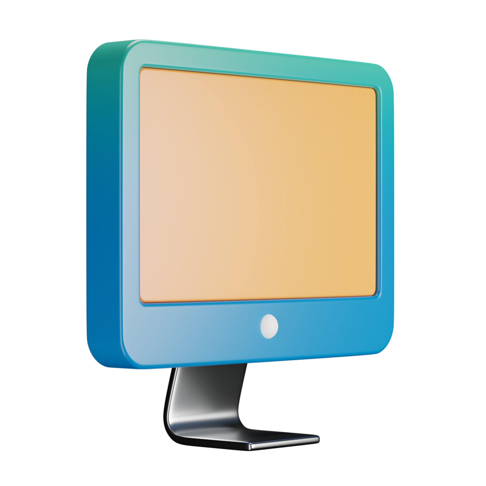
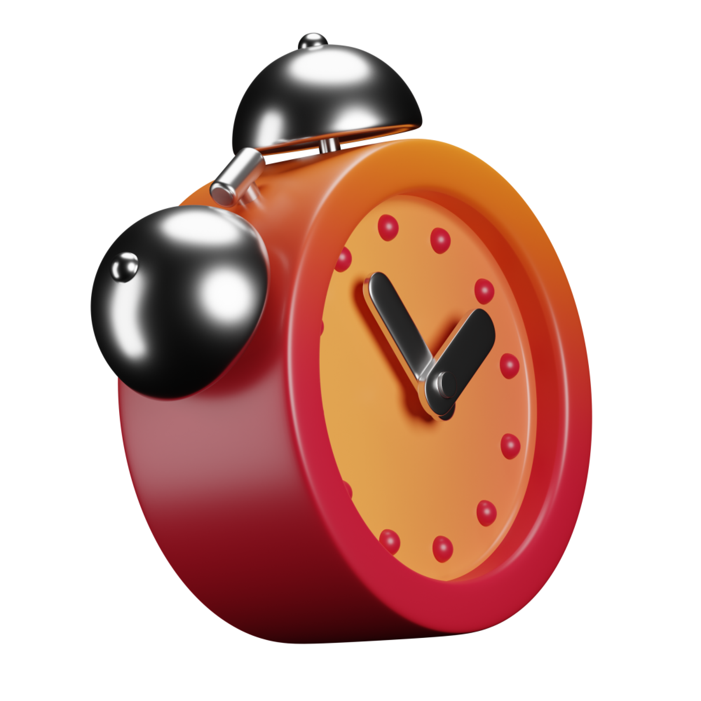
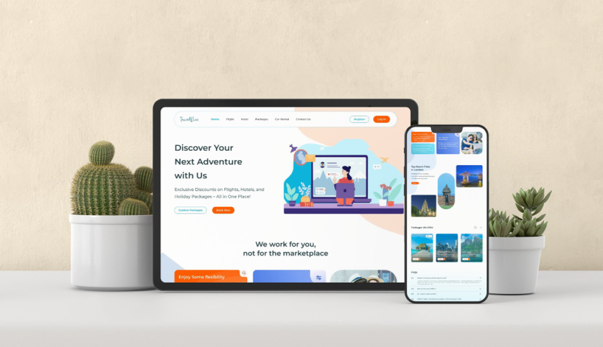
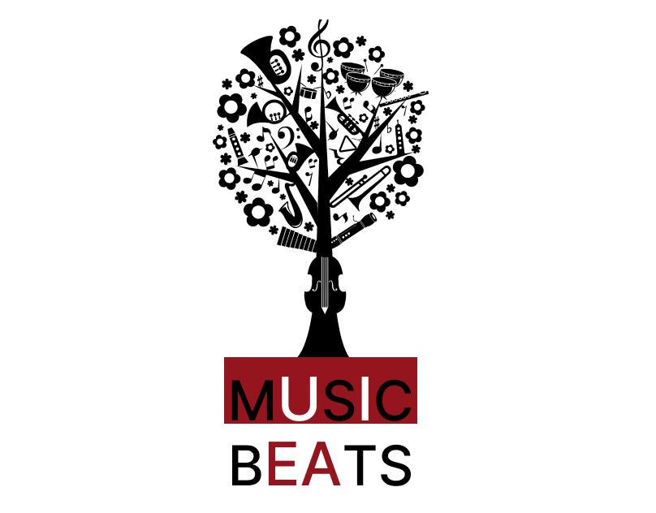
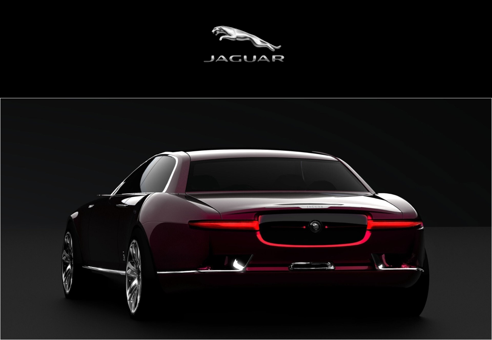

<!DOCTYPE html>
<html lang="en">

<head>
  <meta charset="UTF-8">
  <meta http-equiv="X-UA-Compatible" content="IE=edge">
  <meta name="viewport" content="width=device-width, initial-scale=1.0">
  <title>Oviya Mohan Portfolio</title>

  <!--
    - favicon
  -->
  <link rel="shortcut icon" href="./assets/images/logo.ico" type="image/x-icon">

  <!--
    - custom css link
  -->
  <link rel="stylesheet" href="./css/style.css">
  <!--
    - google font link
  -->
  <link rel="preconnect" href="https://fonts.googleapis.com">
  <link rel="preconnect" href="https://fonts.gstatic.com" crossorigin>
  <link href="https://fonts.googleapis.com/css2?family=Poppins:wght@300;400;500;600&display=swap" rel="stylesheet">
</head>

<body>

  <!--
    - #MAIN
  -->

  <main>

    <!--
      - #SIDEBAR
    -->

    <aside class="sidebar" data-sidebar>

      

        <figure class="avatar-box">
          
          
        </figure>

        

          <h1 class="name" title="Om Kharche">Oviya Mohan</h1>

          
UI/UX Designer

        

        <button class="info_more-btn" data-sidebar-btn>
          Show Contacts

          <ion-icon name="chevron-down"></ion-icon>
        </button>

      

      

        

        <ul class="contacts-list">

          <li class="contact-item">

            

              
            

            

              
Email

              <a href="mailto:oviyacse2001@gmail.com" class="contact-link">oviyacse2001@gmail.com</a>
            

          </li>

          <li class="contact-item">

            

              
            

            

              
Phone

              <a href="tel:+916369035690" class="contact-link">+91 63669035690</a>
            

          </li>

          <!-- <li class="contact-item">

            

              <ion-icon name="calendar-outline"></ion-icon>
            

            

              
Birthday

              <time datetime="1982-06-23">2 March, 2003</time>
            

          </li> -->

          <li class="contact-item">

            

              
            

            

              
Location

              <address>Namakkal, Tamilnadu.</address>
            

          </li>

        </ul>

        

        <ul class="social-list">

          <!-- <li class="social-item">
            <a href="#" class="social-link">
              <ion-icon name="logo-facebook"></ion-icon>
            </a>
          </li> -->

          <li class="social-item">
            <a href="https://www.linkedin.com/in/oviya-m-a078a11a3/" class="social-link">
              <ion-icon name="logo-linkedin"></ion-icon>
            </a>
          </li>

          <li class="social-item">
            <a href="https://www.behance.net/oviya-uiux-designer" class="social-link">
              <ion-icon name="logo-behance"></ion-icon>
            </a>
          </li>

        </ul>

      

    </aside>

    <!--
      - #main-content
    -->

    

      <!--
        - #NAVBAR
      -->

      <nav class="navbar">

        <ul class="navbar-list">

          <li class="navbar-item">
            <button class="navbar-link  active" data-nav-link>About</button>
          </li>

          <li class="navbar-item">
            <button class="navbar-link" data-nav-link>Background</button>
          </li>

          <li class="navbar-item">
            <button class="navbar-link" data-nav-link>Projects</button>
          </li>

          <!-- <li class="navbar-item">
            <button class="navbar-link" data-nav-link>Blog</button>
          </li>

          <li class="navbar-item">
            <button class="navbar-link" data-nav-link>Contact</button>
          </li> -->

        </ul>

      </nav>

      <!--
        - #ABOUT
      -->

      <article class="about  active" data-page="about">

        <header>
          <h2 class="h2 article-title">About me</h2>
        </header>

        <section class="about-text">
          

            I am a passionate and creative UI/UX Designer with 2.9 years of experience in designing intuitive, 
            user-centric interfaces for web and mobile applications. With a proven ability to combine user research 
            and design principles, I specialize in creating seamless experiences that enhance customer satisfaction 
            and drive business results. My mission is to turn complex problems into elegant, engaging solutions.
          

          

            I am proficient in Figma, Adobe XD, InVision, VS Code, HTML, CSS, SCSS, Bootstrap, and Sass, 
            ensuring that my designs are not only visually appealing but also technically sound and aligned with the
            latest industry standards.         
          

        </section>

        <!--
          - service
        -->

        <section class="service">

          <h3 class="h3 service-title">What i'm doing</h3>

          <ul class="service-list">

            <!-- <li class="service-item">

              

                
              

              

                <h4 class="h4 service-item-title">Freelance Projects & Innovation</h4>

                

                  Designing and delivering user-friendly interfaces for various freelance projects, 
                  including a ride-booking app and a kids' routine management app, showcasing my ability to
                  translate complex ideas into engaging, functional designs.
                

              

            </li> -->

            <li class="service-item">

              

                
              

              

                <h4 class="h4 service-item-title">UI Design</h4>

                

                  Designing intuitive user interfaces through information architecture, user flows, wireframes, prototypes, and high-fidelity
                  mockups while aligning with brand identity and user needs.
                

              

            </li>

            <li class="service-item">

              

                
              

              

                <h4 class="h4 service-item-title">UI Development</h4>

                

                  Translating the designs into fully
                  functional, responsive interfaces using HTML, CSS, SCSS, Bootstrap, and Sass, ensuring clean, 
                  maintainable code that meets web standards for optimal performance and usability.
                

              

            </li>
            <!-- <li class="service-item">

              

                
              

              

                <h4 class="h4 service-item-title">Skill Enhancement & Collaboration</h4>

                

                  Continuously improving my technical and creative skills in Figma, Adobe XD, HTML, CSS, 
                  and Bootstrap, while collaborating with clients and developers to align designs with business 
                  objectives and user needs.
                

              

            </li> -->
<!-- 
            <li class="service-item">

              

                
              

              

                <h4 class="h4 service-item-title">Client Collaboration</h4>

                

                 Collaborating with clients and stakeholders to translate business goals into design strategies while ensuring high-quality deliverables.
                

              

            </li>

            <li class="service-item">

              

                
              

              

                <h4 class="h4 service-item-title">Client Collaboration</h4>

                

                  Collaborating with clients and stakeholders to translate business goals into design strategies while ensuring high-quality deliverables.
                

              

            </li>  -->

          </ul>

        </section>

        <!--
          - testimonials
        -->

        <section class="testimonials">

          <h3 class="h3 testimonials-title">Testimonials</h3>

          <ul class="testimonials-list has-scrollbar">

            <li class="testimonials-item">
              

                <figure class="testimonials-avatar-box">
                  
                </figure>

                <h4 class="h4 testimonials-item-title" data-testimonials-title></h4>

                

                  

                    "Thanks for all the help , you came at right time to help me with few Projects. Hope everything works better for you at your new job." — Freelance Client
                  

                

              

            </li>

            <li class="testimonials-item">
              

                <figure class="testimonials-avatar-box">
                  
                </figure>

                <h4 class="h4 testimonials-item-title" data-testimonials-title></h4>

                

                  

                    "Her attention to detail and dedication to understanding the end user resulted in a product that exceeded expectations."
                    — Freelance Client
                  

                

              

            </li>

            <li class="testimonials-item">
              

                <figure class="testimonials-avatar-box">
                
                    
                </figure>

                <h4 class="h4 testimonials-item-title" data-testimonials-title></h4>

                

                  

                    "Oviya's ability to manage tight deadlines while maintaining high-quality work is unmatched. 
                    Thank you so much for Part of our project."
                    — Freelance Client
                  

                

              

            </li>

          </ul>

        </section>

        <!--
          - testimonials modal
        -->

        

          

          <section class="testimonials-modal">

            <button class="modal-close-btn" data-modal-close-btn>
              <ion-icon name="close-outline"></ion-icon>
            </button>

            

              <figure class="modal-avatar-box">
                
              </figure>

              
            

            

              <h4 class="h3 modal-title" data-modal-title>Daniel lewis</h4>

              

                

                  Richard was hired to create a corporate identity. We were very pleased with the work done. She has a
                  lot of experience
                  and is very concerned about the needs of client. Lorem ipsum dolor sit amet, ullamcous cididt
                  consectetur adipiscing
                  elit, seds do et eiusmod tempor incididunt ut laborels dolore magnarels alia.
                

              

            

          </section>

        

        <!--
          - My approach
        -->
        <section class="clients">

          <h3 class="h3">My approach</h3>

          <ul class="clients-list has-scrollbar">

            <li class="service-item clients-item">

              

                Phase 1
                <h4 class="h4 service-item-title">Research & Discovery:</h4>
                

                  Conduct user interviews, competitor analysis, and market research to identify pain points and opportunities.
                

              

            </li>

            <li class="service-item clients-item">

              

                Phase 2
                <h4 class="h4 service-item-title">Ideation & Strategy</h4>
                  

                    Create user personas, define workflows, and sketch wireframes to establish a clear design direction.
                  

              

            </li>

            <li class="service-item clients-item">

              

                Phase 3
                <h4 class="h4 service-item-title">Design & Prototyping</h4>
                

                  Develop high-fidelity designs and interactive prototypes using tools like Figma, Sketch, and Adobe XD.
                

              

            </li>

            <li class="service-item clients-item">

              

                Phase 4
                <h4 class="h4 service-item-title">Testing & Iteration</h4>
                

                  Conduct usability tests, gather feedback, and refine designs to ensure an optimal user experience.
                

              

            </li>

            <li class="service-item clients-item">

              

                Phase 5
                <h4 class="h4 service-item-title">Delivery & Handoff</h4>
                  

                    Collaborate with developers for smooth implementation, providing assets and design specifications.
                  

              

            </li>
<!-- 
            <li class="service-item">

              

                
              

              

                <h4 class="h4 service-item-title">Client Collaboration</h4>

                

                 Collaborating with clients and stakeholders to translate business goals into design strategies while ensuring high-quality deliverables.
                

              

            </li>

            <li class="service-item">

              

                
              

              

                <h4 class="h4 service-item-title">Client Collaboration</h4>

                

                  Collaborating with clients and stakeholders to translate business goals into design strategies while ensuring high-quality deliverables.
                

              

            </li>  -->

          </ul>

        </section>

      </article>

      <!--
        - #RESUME
      -->

      <article class="resume" data-page="background">

        <header>
          <h2 class="h2 article-title">Resume</h2>
        </header>
        
        <section class="timeline">

          

            

              <ion-icon name="book-outline"></ion-icon>
            

            <h3 class="h3">Experience</h3>
          

          <ol class="timeline-list">

            <li class="timeline-item">

              <h4 class="h4 timeline-item-title">UI/UX Engineer</h4>

              2022 — 2024

              

                Led the design and development of user interfaces for web and mobile applications, improving usability and user engagement.
                 
Delivered innovative solutions for complex design problems by conducting user research and usability testing.
 
Collaborated with cross-functional teams to ensure seamless implementation of designs, resulting in a 20% increase in task completion rates
              

            </li>

           

          </ol>

        </section>

        <section class="timeline">

          

            

              <ion-icon name="book-outline"></ion-icon>
            

            <h3 class="h3">Education</h3>
          

          <ol class="timeline-list">

            <li class="timeline-item">

              <h4 class="h4 timeline-item-title">Sri Lakshmi Ammal Engineering Collage - Chennai</h4>

              2017 — 2021

              

               BE - Computer Science & Engineering
              

            </li>

            <li class="timeline-item">

              <h4 class="h4 timeline-item-title">Govt Higher Secondary School - Namakkal</h4>

              2016 — 2017

              

               12th Standard
              

            </li>

            <li class="timeline-item">

              <h4 class="h4 timeline-item-title">Govt Higher Secondary School - Namakkal</h4>

              2014 - 2015

              

                10th Standard
              

            </li>

          </ol>

        </section>

        <!-- <section class="skill">

          <h3 class="h3 skills-title">My skills</h3>

          <ul class="skills-list content-card">

            <li class="skills-item">

              

                <h5 class="h5">Web design</h5>
                <data value="80">80%</data>
              

              

                

              

            </li>

            <li class="skills-item">

              

                <h5 class="h5">Graphic design</h5>
                <data value="70">70%</data>
              

              

                

              

            </li>

            <li class="skills-item">

              

                <h5 class="h5">Branding</h5>
                <data value="90">90%</data>
              

              

                

              

            </li>

            <li class="skills-item">

              

                <h5 class="h5">WordPress</h5>
                <data value="50">50%</data>
              

              

                

              

            </li>

          </ul>

        </section> -->

      </article>

      <!--
        - #PORTFOLIO
      -->

      <article class="portfolio" data-page="projects">

        <header>
          <h2 class="h2 article-title" id="travelease">Portfolio</h2>
        </header>

        <section class="projects">

          <ul class="filter-list">

            <li class="filter-item">
              <button class="active" data-filter-btn>All</button>
            </li>

            <li class="filter-item">
              <button data-filter-btn>Website design</button>
            </li>

            <li class="filter-item">
              <button data-filter-btn>Mobile Applications</button>
            </li>

            <!-- <li class="filter-item">
              <button data-filter-btn></button>
            </li> -->

          </ul>

          

            <button class="filter-select" data-select>

              
Select category

              

                <ion-icon name="chevron-down"></ion-icon>
              

            </button>

            <ul class="select-list">

              <li class="select-item">
                <button data-select-item>All</button>
              </li>

              <li class="select-item">
                <button data-select-item>Web design</button>
              </li>

              <li class="select-item">
                <button data-select-item>Applications</button>
              </li>

              <li class="select-item">
                <button data-select-item>Web development</button>
              </li>

            </ul>

          

          <ul class="project-list">

            <li class="project-item  active" data-filter-item data-category="web design">
              <a href="Travelease.html">

                <figure class="project-img">
                  

                    <ion-icon name="eye-outline"></ion-icon>
                  

                  
                </figure>

                <h3 class="project-title">Travel Ease</h3>

                
Website design(2024)

              </a>
            </li>
            
            <li class="project-item  active" data-filter-item data-category="web design">
              <a href="Musicbeats.html">

                <figure class="project-img">
                  

                    <ion-icon name="eye-outline"></ion-icon>
                  

                  
                </figure>

                <h3 class="project-title">Music Beats</h3>

                
Website design(2021)

              </a>
            </li>

            <li class="project-item  active" data-filter-item data-category="web design">
              <a href="Jaguar.html">

                <figure class="project-img">
                  

                    <ion-icon name="eye-outline"></ion-icon>
                  

                  
                </figure>

                <h3 class="project-title">Jaguar Page Redesign</h3>

                
Website(2021)

              </a>
            </li>
            
            <li class="project-item  active" data-filter-item data-category="web design">
              <a href="Fittrack.html">

                <figure class="project-img">
                  

                    <ion-icon name="eye-outline"></ion-icon>
                  

                  
                </figure>

                <h3 class="project-title">Fittrack</h3>

                
Mobile Application(2024) - Case Study

              </a>
            </li>
           
           

          </ul>

        </section>

      </article>

      <!--
        - #BLOG
      -->

      <!-- <article class="blog" data-page="blog">

        <header>
          <h2 class="h2 article-title">Blog</h2>
        </header>

        <section class="blog-posts">

          <ul class="blog-posts-list">

            <li class="blog-post-item">
              <a href="#">

                <figure class="blog-banner-box">
                  
                </figure>

                

                  

                    
Design

                    

                    <time datetime="2022-02-23">Fab 23, 2022</time>
                  

                  <h3 class="h3 blog-item-title">Design conferences in 2022</h3>

                  

                    Veritatis et quasi architecto beatae vitae dicta sunt, explicabo.
                  

                

              </a>
            </li>

            <li class="blog-post-item">
              <a href="#">

                <figure class="blog-banner-box">
                  
                </figure>

                

                  

                    
Design

                    

                    <time datetime="2022-02-23">Fab 23, 2022</time>
                  

                  <h3 class="h3 blog-item-title">Best fonts every designer</h3>

                  

                    Sed ut perspiciatis, nam libero tempore, cum soluta nobis est eligendi.
                  

                

              </a>
            </li>

            <li class="blog-post-item">
              <a href="#">

                <figure class="blog-banner-box">
                  
                </figure>

                

                  

                    
Design

                    

                    <time datetime="2022-02-23">Fab 23, 2022</time>
                  

                  <h3 class="h3 blog-item-title">Design digest #80</h3>

                  

                    Excepteur sint occaecat cupidatat no proident, quis nostrum exercitationem ullam corporis suscipit.
                  

                

              </a>
            </li>

            <li class="blog-post-item">
              <a href="#">

                <figure class="blog-banner-box">
                  
                </figure>

                

                  

                    
Design

                    

                    <time datetime="2022-02-23">Fab 23, 2022</time>
                  

                  <h3 class="h3 blog-item-title">UI interactions of the week</h3>

                  

                    Enim ad minim veniam, consectetur adipiscing elit, quis nostrud exercitation ullamco laboris nisi.
                  

                

              </a>
            </li>

            <li class="blog-post-item">
              <a href="#">

                <figure class="blog-banner-box">
                  
                </figure>

                

                  

                    
Design

                    

                    <time datetime="2022-02-23">Fab 23, 2022</time>
                  

                  <h3 class="h3 blog-item-title">The forgotten art of spacing</h3>

                  

                    Maxime placeat, sed do eiusmod tempor incididunt ut labore et dolore magna aliqua.
                  

                

              </a>
            </li>

            <li class="blog-post-item">
              <a href="#">

                <figure class="blog-banner-box">
                  
                </figure>

                

                  

                    
Design

                    

                    <time datetime="2022-02-23">Fab 23, 2022</time>
                  

                  <h3 class="h3 blog-item-title">Design digest #79</h3>

                  

                    Optio cumque nihil impedit uo minus quod maxime placeat, velit esse cillum.
                  

                

              </a>
            </li>

          </ul>

        </section>

      </article> -->

      <!--
        - #CONTACT
      -->

      <!-- <article class="contact" data-page="contact">

        <header>
          <h2 class="h2 article-title">Contact</h2>
        </header>

        <section class="mapbox" data-mapbox>
          <figure>
            <iframe
              src="https://maps.google.com/maps?width=100%25&amp;height=600&amp;hl=en&amp;q=chennai+(My%20Business%20Name)&amp;t=&amp;z=14&amp;ie=UTF8&amp;iwloc=B&amp;output=embed"
              width="400" height="300" loading="lazy"></iframe>
          </figure>
        </section>

        <section class="contact-form">

          <h3 class="h3 form-title">Contact Form</h3>

          <form action="#" class="form" data-form>

            

              <input type="text" name="fullname" class="form-input" placeholder="Full name" required data-form-input>

              <input type="email" name="email" class="form-input" placeholder="Email address" required data-form-input>
            

            <textarea name="message" class="form-input" placeholder="Your Message" required data-form-input></textarea>

            <button class="form-btn" type="submit" disabled data-form-btn>
              <ion-icon name="paper-plane"></ion-icon>
              Send Message
            </button>

          </form>

        </section>

      </article> -->

    

  </main>

  <!--
    - custom js link
  -->
  

  <!--
    - ionicon link
  -->
  
  

</body>

</html>
